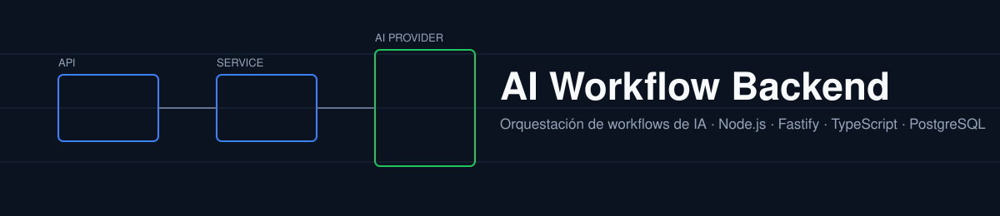
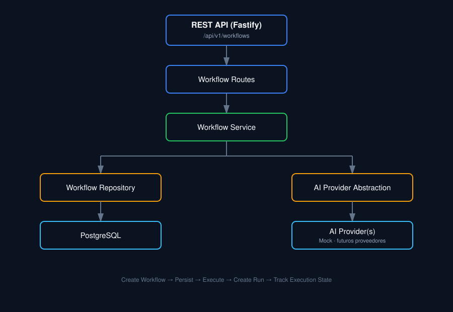

<p align="center">
  
</p>

<p align="center">
  <a href="https://github.com/Nicolas-Pedernera/ai-workflow-backend/actions/workflows/test.yml">
    
  </a>
  
  =18" />
  
  
  
  
</p>

Backend en [Fastify](https://github.com/fastify/fastify) + TypeScript para orquestación de workflows de IA, construido sobre **Clean Architecture, vertical slices y un patrón CQRS ligero**. Incluye persistencia en PostgreSQL, registro on-chain de workflows (smart contract vía `viem`) y un motor de análisis de riesgo de liquidación como capa de dominio pura.

## Tabla de contenidos

- [Features](#features)
- [Prerequisitos](#prerequisitos)
- [Getting Started](#getting-started)
- [Scripts disponibles](#scripts-disponibles)
- [Correr con Docker](#correr-con-docker)
- [API Endpoints](#api-endpoints)
- [Arquitectura](#arquitectura)
  - [Principios](#principios)
  - [Módulos](#módulos)
  - [Componentes de un módulo](#componentes-de-un-módulo)
- [Estructura de carpetas](#estructura-de-carpetas)
- [Testing](#testing)
- [CI/CD](#cicd)
- [Desarrollo asistido por IA](#desarrollo-asistido-por-ia)
- [Roadmap](#roadmap)
- [Recursos útiles](#recursos-útiles)
- [Contribuir](#contribuir)
- [Licencia](#licencia)
- [Autor](#autor)

## Features

| Categoría | Detalle |
|---|---|
| **Runtime** | Node.js + TypeScript, ejecución en dev con `tsx` (watch mode) |
| **Framework** | [Fastify](https://github.com/fastify/fastify) |
| **API** | REST, versionada bajo `/api/v1` |
| **Base de datos** | PostgreSQL vía [`pg`](https://node-postgres.com/) + migraciones SQL propias |
| **Arquitectura** | Clean Architecture por vertical slices + Command/Query Bus |
| **Blockchain** | Registro on-chain de workflows vía smart contract Solidity ([`viem`](https://viem.sh/) como cliente RPC) |
| **Riesgo** | Motor de análisis de riesgo de liquidación (lógica de dominio pura, sin dependencias externas) |
| **IA** | Abstracción de proveedores de IA (mock, Ollama, OpenAI-compatible) intercambiables por configuración |
| **Testing** | [Vitest](https://vitest.dev/) — unitarios, de integración y de infraestructura real (blockchain local) |
| **Calidad** | ESLint |
| **Docker** | Entorno de desarrollo con Docker Compose (Postgres) |
| **CI** | GitHub Actions con servicio Postgres real en cada push/PR |
| **AI-Ready** | [AGENTS.md](AGENTS.md) — reglas de arquitectura y convenciones para asistentes de IA |

## Prerequisitos

| Herramienta | Notas |
|---|---|
| **Node.js** | >= 18 |
| **npm** | incluido con Node.js |
| **Docker** | para levantar PostgreSQL vía Docker Compose (alternativamente, usar una instancia local) |
| **Hardhat** (opcional) | solo necesario para correr el smart contract localmente (`npx hardhat node`) |

## Getting Started

```bash
# 1. Clonar el repo
git clone https://github.com/Nicolas-Pedernera/ai-workflow-backend.git
cd ai-workflow-backend

# 2. Instalar dependencias
npm install

# 3. Crear tu archivo .env
cp .env.example .env

# 4. Levantar PostgreSQL
docker compose up -d

# 5. Correr las migraciones
npm run db:migrate

# 6. Levantar el servidor de desarrollo (watch mode)
npm run dev
```

El servidor arranca en **http://localhost:3000** por defecto. Ver [API Endpoints](#api-endpoints) para lo que está disponible.

## Scripts disponibles

### Desarrollo

| Script | Descripción |
|---|---|
| `npm run dev` | Levanta el servidor en modo watch (`tsx watch`) |
| `npm start` | Levanta el servidor de producción (requiere `npm run build` antes) |

### Calidad de código

| Script | Descripción |
|---|---|
| `npm run build` | Compila TypeScript a `dist/` |
| `npm run lint` | Corre ESLint sobre todo el proyecto |
| `npx tsc --noEmit` | Chequeo de tipos sin generar output |

### Testing

| Script | Descripción |
|---|---|
| `npm test` | Corre toda la suite de Vitest (requiere Postgres corriendo) |

### Base de datos

| Script | Descripción |
|---|---|
| `npm run db:migrate` | Aplica las migraciones SQL pendientes contra `DATABASE_URL` |

## Correr con Docker

```bash
cp .env.example .env      # si no lo hiciste ya
docker compose up -d      # levanta PostgreSQL
npm run db:migrate
npm run dev
```

## API Endpoints

| Método | Endpoint | Descripción |
|---|---|---|
| `GET` | `/health` | Health check básico del servicio |
| `GET` | `/health/ready` | Readiness check (verifica DB + blockchain) |
| `GET` | `/api/v1/status` | Estado general de la API |
| `POST` | `/api/v1/workflows` | Crea un nuevo workflow (lo registra también on-chain) |
| `GET` | `/api/v1/workflows` | Lista todos los workflows |
| `GET` | `/api/v1/workflows/:id` | Obtiene un workflow por id |
| `GET` | `/api/v1/workflows/:id/blockchain` | Consulta el estado del workflow directamente en el smart contract |
| `PATCH` | `/api/v1/workflows/:id/status` | Activa/desactiva un workflow (on-chain + DB) |
| `POST` | `/api/v1/workflows/:id/run` | Ejecuta un workflow |
| `GET` | `/api/v1/runs/:id` | Consulta el estado de una ejecución |

<details>
<summary>Ejemplo: crear y ejecutar un workflow (curl)</summary>

```bash
# Crear un workflow
curl -X POST http://localhost:3000/api/v1/workflows \
  -H "Content-Type: application/json" \
  -d '{"name": "example-workflow"}'

# Ejecutarlo
curl -X POST http://localhost:3000/api/v1/workflows/<id>/run

# Consultar la ejecución
curl http://localhost:3000/api/v1/runs/<runId>
```

</details>

## Arquitectura

<p align="center">
   Workflow Routes -> Workflow Service -> Repository/AI Provider -> PostgreSQL/AI Provider(s)" width="100%" />
</p>

### Principios

**A nivel de proyecto:**

- **Complejidad adaptable** — la estructura escala agregando o quitando capas según lo que la feature realmente necesite (no todo requiere un domain service).
- **Framework al margen del negocio** — la lógica de negocio no depende de Fastify; las particularidades de HTTP quedan en las rutas.
- **Vertical slices** — cada acción del sistema (crear workflow, ejecutar workflow, etc.) es autocontenida: todo lo que esa feature necesita vive en su propia carpeta.

**A nivel de código:**

- **Núcleo agnóstico de infraestructura** — el dominio nunca importa `pg`, `viem` ni Fastify directamente.
- **Handlers agnósticos de protocolo** — un command/query handler podría servir igual a REST, un worker, o un CLI.
- **Dominio agnóstico de base de datos** — el SQL vive únicamente en los repositorios, que implementan un puerto (interfaz) que el dominio consume.
- **Flujo de dependencias hacia adentro**: `Route → Handler → Domain → Repository`, nunca al revés.

Inspirado en:

- [Domain-Driven Design (DDD)](https://en.wikipedia.org/wiki/Domain-driven_design)
- [Hexagonal (Ports and Adapters) Architecture](<https://en.wikipedia.org/wiki/Hexagonal_architecture_(software)>)
- [Clean Architecture](https://blog.cleancoder.com/uncle-bob/2012/08/13/the-clean-architecture.html)
- [Vertical Slice Architecture](https://www.jimmybogard.com/vertical-slice-architecture/)

### Módulos

Cada módulo mapea un concepto de dominio y vive en su propia carpeta bajo `src/modules/`: `workflows`, `health`, `blockchain`, `risk`.

**Reglas clave:**

- **Sin imports directos entre módulos** — la comunicación entre módulos pasa por el command/query bus (`src/shared/cqrs/`).
- **Extraíble** — cualquier módulo podría convertirse en su propio servicio; el límite del handler CQRS ya es el límite de red natural.
- **Si dos módulos son muy "charlatanes" entre sí**, probablemente deberían fusionarse.

### Componentes de un módulo

**Route** — traduce HTTP ↔ bus. Valida el input, formatea la respuesta. Sin lógica de negocio.
Ejemplo: [`find-workflows.route.ts`](src/modules/workflows/queries/find-workflows/find-workflows.route.ts)

**Command/Query Handler** — orquesta el caso de uso: recibe el comando o query, llama al dominio y a los repositorios a través de puertos, devuelve un resultado.
Ejemplo: [`create-workflow.handler.ts`](src/modules/workflows/commands/create-workflow/create-workflow.handler.ts)

**Domain Service** — lógica de negocio pura. Calcula, valida invariantes, compone entidades. Sin dependencias de infraestructura.
Ejemplo: [`workflow.domain.ts`](src/modules/workflows/domain/workflow.domain.ts)

**Repository** — acceso a datos. Convierte entre modelos de dominio y filas de base de datos. Implementa un puerto (interfaz) definido junto a él.
Ejemplo: [`workflow.repository.ts`](src/modules/workflows/database/workflow.repository.ts)

> **Guía práctica:** usá tantas capas como la feature necesite. No todo requiere un domain service — un CRUD simple puede ir directo de handler a repositorio (ver `health`).

## Estructura de carpetas

```
src/
├── app.ts
├── server.ts
├── config/
│   ├── database.ts
│   └── blockchain.ts
├── shared/
│   ├── cqrs/                       # Command/Query bus compartido
│   ├── exceptions/                 # Excepciones de dominio base
│   └── error-handler.ts            # Traduce excepciones de dominio a HTTP
├── modules/
│   ├── workflows/
│   │   ├── commands/
│   │   │   ├── create-workflow/
│   │   │   ├── run-workflow/
│   │   │   └── set-workflow-status/
│   │   ├── queries/
│   │   │   ├── find-workflows/
│   │   │   ├── find-workflow-by-id/
│   │   │   ├── find-run-by-id/
│   │   │   └── get-blockchain-workflow/
│   │   ├── domain/                 # tipos, errores y lógica pura
│   │   ├── database/                # puerto + repositorio Postgres
│   │   └── index.ts                 # composición del módulo
│   ├── health/
│   │   ├── queries/get-readiness/
│   │   ├── domain/
│   │   ├── database/                # puerto + chequeo Postgres
│   │   └── index.ts
│   ├── blockchain/
│   │   ├── client/                  # adaptador viem/RPC al smart contract
│   │   └── domain/                  # errores de dominio
│   └── risk/
│       └── domain/                  # motor de análisis de riesgo (lógica pura)
└── providers/
    └── ai/
        ├── ai-provider.ts
        ├── ai-provider.factory.ts
        ├── mock-ai-provider.ts
        ├── ollama-ai-provider.ts
        └── openai-compatible-ai-provider.ts

test/
├── app.test.ts
├── workflows.test.ts
├── create-workflow.handler.test.ts
├── risk-analyzer.test.ts
├── blockchain-integration.test.ts
├── ai-provider-factory.test.ts
└── helpers/
    └── in-memory-workflow-repository.ts

contracts/
└── WorkflowRegistry.sol             # smart contract del registro de workflows

migrations/                          # migraciones SQL versionadas
```

## Testing

```bash
docker compose up -d      # Postgres
npm run db:migrate
npm test
```

La suite corre con **Vitest** y cubre:

- **API de workflows** (`workflows.test.ts`) — creación, listado, ejecución, cambio de estado, manejo de errores, con un repositorio en memoria y blockchain mockeada (sin dependencias externas).
- **Handlers unitarios** (`create-workflow.handler.test.ts`) — lógica de orquestación aislada con mocks.
- **Health checks** (`app.test.ts`) — readiness con DB/blockchain simuladas en distintos estados.
- **Motor de riesgo** (`risk-analyzer.test.ts`) — lógica de dominio pura, sin mocks.
- **Integración real con blockchain** (`blockchain-integration.test.ts`) — requiere un nodo Hardhat local corriendo con el contrato deployado (ver [docs/blockchain.md](docs/blockchain.md)).

## CI/CD

El pipeline (`.github/workflows/test.yml`) corre en cada push/PR a `main`:

1. Instala dependencias (`npm ci`)
2. Levanta un servicio de PostgreSQL real (contenedor efímero)
3. Corre las migraciones (`npm run db:migrate`)
4. Build (`npm run build`)
5. Lint (`npm run lint`)
6. Tests (`npm test`)

## Desarrollo asistido por IA

Este proyecto incluye un archivo [`AGENTS.md`](AGENTS.md) — una guía de arquitectura y convenciones para asistentes de IA (GitHub Copilot, Claude Code, Cursor, etc.). Documenta la organización en vertical slices, el patrón CQRS y las reglas al agregar una feature nueva, para que el código generado por IA siga los mismos patrones que el resto del repo.

## Roadmap

- [ ] Ejecución asíncrona de workflows / jobs en background
- [ ] Cache con Redis
- [ ] Ejecución de workflows basada en eventos
- [ ] Proveedores de IA adicionales
- [ ] Procesamiento de webhooks
- [ ] Autenticación y autorización
- [ ] Observabilidad y métricas (tracing, logs estructurados)
- [ ] Rate limiting
- [ ] Ejecución distribuida
- [ ] Automatización de despliegue a producción

## Recursos útiles

- [fastify-boilerplate](https://github.com/marcoturi/fastify-boilerplate) — referencia principal de arquitectura para este proyecto (Clean Architecture, CQRS, vertical slices)
- [Domain-Driven Hexagon](https://github.com/Sairyss/domain-driven-hexagon) — inspiración original de estos patrones

## Contribuir

Las contribuciones son bienvenidas. Ver [CONTRIBUTING.md](CONTRIBUTING.md) para la guía de estilo y cómo correr los checks de calidad antes de un PR, y [Issue #1](https://github.com/Nicolas-Pedernera/ai-workflow-backend/issues/1) si buscás algo concreto para empezar a aportar.

1. Fork y clonar el repo
2. Crear una rama: `git checkout -b tu-feature`
3. Hacer los cambios siguiendo la arquitectura descripta arriba
4. Correr `npm run build && npm run lint && npm test`
5. Abrir un Pull Request

## Licencia

Distribuido bajo licencia MIT. Ver [LICENSE](LICENSE).

## Autor

**Nicolás Pedernera**

Systems Engineer — Universidad de Buenos Aires, 2024

Enfocado en backend engineering, fintech, criptomonedas, infraestructura blockchain y sistemas de IA.

- GitHub: [Nicolas-Pedernera](https://github.com/Nicolas-Pedernera)
- LinkedIn: [nicolas-pedernera-zendx](https://www.linkedin.com/in/nicolas-pedernera-zendx/)
- Upwork: [perfil de freelancer](https://www.upwork.com/freelancers/~017eec2171ae9d8805)
