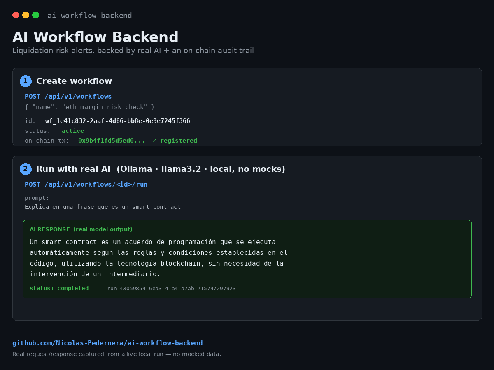

# AI Workflow Backend

AI-assisted risk and liquidation alerting backend for leveraged trading workflows, combining deterministic financial calculations, AI-generated explanations, persistent execution state, and blockchain-backed workflow registration.

Built with **TypeScript, Fastify, PostgreSQL, Ollama, Solidity, viem, Hardhat, and Vitest**.




## Overview

This project demonstrates a modular backend architecture for executing AI-assisted workflows against structured financial data.

The current use case focuses on **liquidation risk analysis for leveraged trading positions**.

A workflow can:

1. Receive structured trading position data.
2. Calculate deterministic risk metrics.
3. Send those metrics to an AI provider.
4. Generate a human-readable risk assessment.
5. Persist the workflow execution in PostgreSQL.
6. Maintain workflow lifecycle state.
7. Register workflows on-chain through an EVM-compatible smart contract.

The deterministic risk engine is intentionally separated from the AI layer so that financial calculations do not depend on the language model.

---

## Architecture

```text
Client / API
     |
     v
+----------------------+
|     Fastify API      |
|    REST Endpoints    |
+----------+-----------+
           |
           v
+----------------------+
|   WorkflowService    |
|    Orchestration     |
+----+-------------+---+
     |             |
     |             v
     |     +----------------------+
     |     | Deterministic Risk   |
     |     |      Analyzer        |
     |     |                      |
     |     | Exposure             |
     |     | Price Change         |
     |     | PnL                  |
     |     | Equity               |
     |     | Liquidation Price    |
     |     | Risk Level            |
     |     +----------+-----------+
     |                |
     |                v
     |     +----------------------+
     |     |     AI Provider      |
     |     |                      |
     |     | Ollama / Mock        |
     |     +----------+-----------+
     |                |
     |                v
     |        Risk Assessment
     |
     v
+----------------------+
|      PostgreSQL      |
|  Workflows + Runs    |
+----------------------+

           |
           v
+----------------------+
|   WorkflowRegistry   |
|    Solidity / EVM    |
+----------------------+
